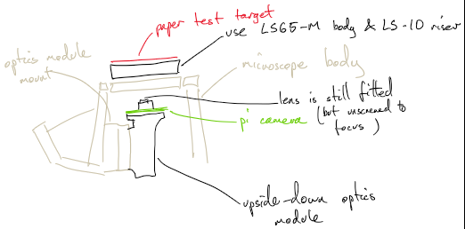

# microscope_fatigue_testing
Fatigue testing scripts for the openflexure microscope, based on Ed Meng's project scripts  GNU GPL v3

This is quite a sketchy folder of scripts that I have adapted quite quickly to run fatigue tests.  They will hopefully mature over time!  They are not yet intended for public consumption, use at your own risk.

## Hardware set-up
To run fatigue tests, you will need a motorised openflexure microscope, along with a modified optics module - use one of the RMS optics modules, with the sample riser (so the stage is 75mm high), but turn the optics module upside down.  You'll probably need to cut the module to fit it in the dovetail. Put the raspberry pi camera module, with the lens still in place, on the top of the optics module, pointing at the sample - you should end up with the camera looking at the sample from a distance of ~30mm.



Use the focusing ring supplied with the camera, or the printed lens removal tool, to adjust the focus of the pi camera's lens by unscrewing it until you can focus on a target placed on the microscope stage.  I reccommend using the one from the test target folder in this repository, which will give a nice strong correlation signal.

## Preparing for the fatigue test
Once you have the microscope set up so you can see the target, in focus, you'll need to centre the microscope on the test target.  Probably the easiest way to do this is:

1. Ensure the microscope is centred, i.e. bottoms of the X and Y actuators are parallel with the bottom of the microscope body.  It doesn't have to be perfectly exact, but it's helpful to start close to the middle of the microscope's travel.

2. Place the printed target on the stage and start the ``openflexure_microscope`` software.  Zoom in on the centre of the image, and adjust the position of the test target until it is central.

3. Stick the test target in place with some tape

Now, the microscope should be looking at the centre of the pattern, and you're ready to start.  Exit the ``openflexure_microscope`` software and run:
```
python test_crosscorrelation.py
```
This should run the camera briefly and pop up some graphs - it will also save a file called ``template.npz`` which is used by the next step.  One of these graphs should be a cropped image of the central cross of the target.  The other image should be a single small bright dot on a black background.  If you have not centred the target accurately enough, your template image will not show the central cross, and will instead show the grid.  The image that should show a single dot will then probably show many dots.  This means your subsequent tests are unlikely to produce reliable data, and you should re-centre the target.

## Running the test
You should first prepare the microscope as in the previous section - in particular you must re-run ``test_crosscorrelation.py`` in order to regenerate the template image.  Then, run:
```
python fatigue_test.py
```
This will move the microscope back and forth, recording position data as it goes.  It will run until you stop it by pressing ``Ctrl`` + ``c``.  Once it has stopped, the data will be saved in ``fatigue_test.hdf5``, and may be plotted by running ``python fatigue_test_plot.py``.

## TODO
Future improvements should include:

* Plotting on-the-fly so we can see what's going on
* Saving images as we go, to make it easier to monitor when things go wrong
* Automatically determining the range of the stage by looking for deviation from the expected trajectory
* More sophisticated test patterns than linear motion
* Command line arguments
